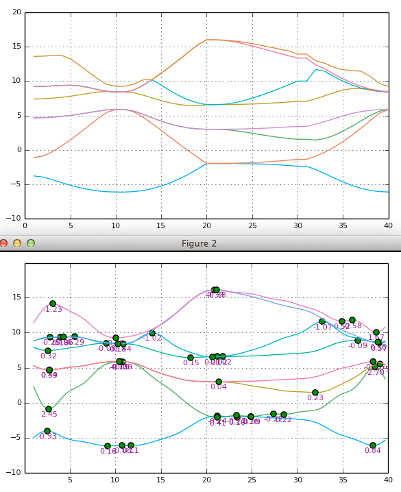

# ApproxEffectiveMass
Effective mass from a (VASP?) bandstructure calculation via ApproxFun fitting to the bands, a WIP.

The idea is to read in a band structure, and calculate the effective mass associated with the band extrema, in an automagic manner. 
Currently this is at the level of the `EIGENVAL` file from `VASP`, which is after you have already 'walked in Brillouin space' between the high symmetry locations (such as Gamma and L, Gamma and R) to form your band structure. 
From these tabulated band functions, the code then builds a Chebyshev/Fourier approximation to the function by solving the fitting problem with linear algebra through a Vandermonde matrix. 
The `ApproxFun` package then allows direct access to analytic solutions of this approximated function, finding the extrema (where `f'=0`) and the associated effective mass (`meff=f''`) associated with these points.

## Plans

[ ] Make the code walk itself through reciprocal space
[ ] Read in the full Brillouin zone directly (`WAVECAR`), locate extrema and calculate the effective masses associated with the extrema (Fermi Pockets) thus discovered
[ ] do this at the WAVECAR or equivalent level, directly using the plane waves as Fourier coefficients in the ApproxFun'ctions

### Other codes

* https://github.com/afonari/emc is a working & generally more useful effective-mass calculator (finite difference method)
